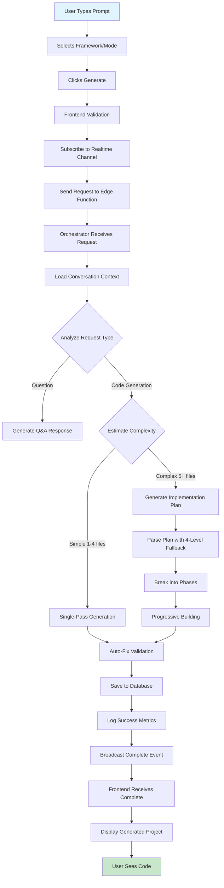
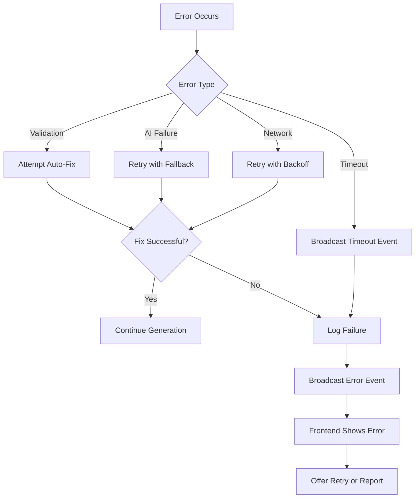

# Complete Generation Flow - User Journey

**Version:** 1.0  
**Last Updated:** 2025-01-10  
**Status:** Production Documentation

---

## 🎯 Overview

This document describes the **complete end-to-end flow** of code generation from the moment a user types a prompt to when they see their generated project. It covers every step, decision point, real-time update, and error handling mechanism.

---

## 🚀 The Journey: Start to Finish



---

## 📱 Phase 1: User Interface

### Step 1.1: User Input

**Location:** Workspace page (`src/pages/Workspace.tsx`)

**Elements:**
- Text input for prompt
- Framework selector (React/HTML/Vue)
- Generate button
- Real-time progress indicator

**User Actions:**
```typescript
// User types prompt
const [prompt, setPrompt] = useState('');

// Selects framework
const [framework, setFramework] = useState<'react' | 'html' | 'vue'>('react');

// Clicks generate
const handleGenerate = async () => {
  // Validation
  if (!prompt.trim()) {
    toast.error('Please enter a description');
    return;
  }
  
  // Show loading state
  setIsGenerating(true);
  
  // Subscribe to updates
  subscribeToProgress(projectId);
  
  // Send request
  await generateProject(prompt, framework, projectId);
};
```

### Step 1.2: Real-Time Subscription Setup

**Purpose:** Establish WebSocket connection for live updates

```typescript
useEffect(() => {
  // Create channel for this project
  const channel = supabase
    .channel(`ai-status-${projectId}`)
    .on('broadcast', { event: 'status-update' }, (payload) => {
      updateProgress(payload);
    })
    .on('broadcast', { event: 'generation:complete' }, (payload) => {
      handleComplete(payload);
    })
    .on('broadcast', { event: 'generation:error' }, (payload) => {
      handleError(payload);
    })
    .on('broadcast', { event: 'generation:timeout' }, (payload) => {
      handleTimeout(payload);
    })
    .subscribe();
  
  return () => {
    supabase.removeChannel(channel);
  };
}, [projectId]);
```

**Component:** `src/components/LiveGenerationProgress.tsx`

---

## 🔄 Phase 2: Backend Processing

### Step 2.1: Request Reception

**Location:** `supabase/functions/mega-mind-orchestrator/index.ts`

```typescript
serve(async (req) => {
  const corsHeaders = {
    'Access-Control-Allow-Origin': '*',
    'Access-Control-Allow-Headers': 'authorization, x-client-info, apikey, content-type',
  };
  
  if (req.method === 'OPTIONS') {
    return new Response(null, { headers: corsHeaders });
  }
  
  try {
    const { 
      userRequest, 
      conversationId, 
      projectId,
      framework 
    } = await req.json();
    
    // Start with timeout protection
    return await Promise.race([
      processRequest(userRequest, conversationId, projectId, framework),
      timeoutPromise(projectId)
    ]);
    
  } catch (error) {
    return handleError(error, corsHeaders);
  }
});
```

### Step 2.2: Context Loading

**Purpose:** Gather conversation history for AI context

```typescript
async function loadContext(conversationId: string) {
  // Get last 10 messages
  const { data: messages } = await supabase
    .from('conversations')
    .select('messages')
    .eq('id', conversationId)
    .single();
  
  // Get approved architecture plans
  const { data: plans } = await supabase
    .from('architecture_plans')
    .select('*')
    .eq('conversation_id', conversationId)
    .eq('approved', true)
    .order('created_at', { ascending: false });
  
  // Get project metadata
  const { data: project } = await supabase
    .from('projects')
    .select('html_code, framework')
    .eq('id', projectId)
    .single();
  
  return {
    messages: messages?.slice(-10) || [],
    plans: plans || [],
    existingCode: project?.html_code || null,
    framework: project?.framework || 'react'
  };
}
```

### Step 2.3: Intent Analysis

**Purpose:** Understand what user wants

```typescript
interface IntentAnalysis {
  type: 'question' | 'generation' | 'modification';
  complexity: 'simple' | 'medium' | 'complex';
  estimatedFiles: number;
  requiresPlanning: boolean;
  framework: string;
}

async function analyzeIntent(
  userRequest: string,
  context: ConversationContext
): Promise<IntentAnalysis> {
  // Question indicators
  const questionWords = ['what', 'how', 'why', 'when', 'where', 'which', 'can', 'should'];
  const isQuestion = questionWords.some(word => 
    userRequest.toLowerCase().includes(word)
  );
  
  if (isQuestion && !userRequest.toLowerCase().includes('create')) {
    return {
      type: 'question',
      complexity: 'simple',
      estimatedFiles: 0,
      requiresPlanning: false,
      framework: context.framework
    };
  }
  
  // Estimate file count based on request
  const estimatedFiles = estimateFileCount(userRequest);
  
  // Modification vs new generation
  const isModification = context.existingCode && 
    userRequest.match(/update|change|fix|modify|edit/i);
  
  return {
    type: isModification ? 'modification' : 'generation',
    complexity: estimatedFiles < 5 ? 'simple' : 
                estimatedFiles < 15 ? 'medium' : 'complex',
    estimatedFiles,
    requiresPlanning: estimatedFiles >= 5,
    framework: context.framework
  };
}
```

**Broadcast to Frontend:**
```typescript
await broadcastStatus(projectId, {
  status: 'analyzing',
  progress: 5,
  message: '🔍 Understanding your requirements...'
});
```

---

## 🎯 Phase 3A: Simple Generation (1-4 Files)

### Step 3A.1: Single AI Call

**Purpose:** Generate all files at once for simple projects

```typescript
async function singlePassGeneration(
  userRequest: string,
  context: ConversationContext,
  projectId: string
) {
  // Broadcast start
  await broadcastStatus(projectId, {
    status: 'generating',
    progress: 20,
    message: '🏗️ Building your project...'
  });
  
  // Generate with AI
  const response = await generateCode({
    prompt: userRequest,
    framework: context.framework,
    existingCode: context.existingCode,
    conversationHistory: context.messages,
    model: 'google/gemini-2.5-flash'
  });
  
  // Parse with 4-level fallback
  const files = await robustJSONParse(response);
  
  // Update progress
  await broadcastStatus(projectId, {
    status: 'finalizing',
    progress: 80,
    message: '✨ Adding final touches...'
  });
  
  return files;
}
```

**Real-Time Updates:**
```
Progress: 5%  → "🔍 Understanding your requirements..."
Progress: 20% → "🏗️ Building your project..."
Progress: 80% → "✨ Adding final touches..."
Progress: 95% → "🔧 Validating code..."
```

---

## 🎯 Phase 3B: Complex Generation (5+ Files)

### Step 3B.1: Generate Implementation Plan

**Purpose:** Break down complex project into manageable phases

```typescript
async function generateImplementationPlan(
  userRequest: string,
  context: ConversationContext,
  projectId: string
): Promise<ImplementationPlan> {
  // Broadcast planning
  await broadcastStatus(projectId, {
    status: 'analyzing',
    progress: 10,
    message: '📋 Creating implementation plan...'
  });
  
  const planPrompt = `
    Create a detailed implementation plan for: "${userRequest}"
    
    Framework: ${context.framework}
    
    Break down into phases with max 20 files per phase.
    
    Return JSON with this structure:
    {
      "overview": "High-level description",
      "phases": [
        {
          "phaseNumber": 1,
          "name": "Foundation",
          "files": [
            {
              "filename": "index.tsx",
              "description": "Main entry point",
              "dependencies": []
            }
          ]
        }
      ]
    }
  `;
  
  const response = await callAI(planPrompt, 'google/gemini-2.5-pro');
  
  // 4-level JSON parsing
  const plan = await robustJSONParse(response);
  
  return plan;
}
```

### Step 3B.2: Phase-by-Phase Building

**Purpose:** Build each phase sequentially with validation

```typescript
async function progressiveBuild(
  plan: ImplementationPlan,
  context: ConversationContext,
  projectId: string
): Promise<FileDefinition[]> {
  
  const allFiles: FileDefinition[] = [];
  const totalPhases = plan.phases.length;
  
  for (let i = 0; i < plan.phases.length; i++) {
    const phase = plan.phases[i];
    const phaseProgress = (i / totalPhases) * 70 + 20; // 20-90%
    
    // Broadcast phase start
    await broadcastStatus(projectId, {
      status: 'generating',
      progress: phaseProgress,
      message: `🏗️ Phase ${i + 1}/${totalPhases}: ${phase.name}`,
      phase: i + 1,
      totalPhases
    });
    
    // Build each file in phase
    const phaseFiles = await buildPhaseFiles(
      phase,
      allFiles, // Previously built files as context
      projectId,
      phase.files.length
    );
    
    // Validate phase
    const validation = await validatePhase(phaseFiles);
    if (!validation.passed) {
      // Attempt auto-fix
      phaseFiles = await autoFixPhase(phaseFiles, validation.issues);
    }
    
    allFiles.push(...phaseFiles);
  }
  
  return allFiles;
}
```

### Step 3B.3: File-by-File Generation

**Purpose:** Generate and broadcast progress for each file

```typescript
async function buildPhaseFiles(
  phase: Phase,
  previousFiles: FileDefinition[],
  projectId: string,
  totalFiles: number
): Promise<FileDefinition[]> {
  
  const files: FileDefinition[] = [];
  
  for (let i = 0; i < phase.files.length; i++) {
    const fileSpec = phase.files[i];
    
    // Determine file type emoji
    const emoji = getFileEmoji(fileSpec.filename);
    
    // Broadcast file progress
    await broadcastStatus(projectId, {
      status: 'generating',
      progress: calculateProgress(i, totalFiles),
      message: `${emoji} Building ${fileSpec.filename}`,
      file: fileSpec.filename,
      fileNumber: i + 1,
      totalFiles
    });
    
    // Generate file
    const fileContent = await generateFile({
      filename: fileSpec.filename,
      description: fileSpec.description,
      dependencies: fileSpec.dependencies,
      previousFiles,
      framework: context.framework
    });
    
    files.push({
      filename: fileSpec.filename,
      content: fileContent
    });
    
    // Small delay for UI update
    await sleep(100);
  }
  
  return files;
}

// File type emojis
function getFileEmoji(filename: string): string {
  if (filename.includes('index')) return '🏠';
  if (filename.includes('component') || filename.endsWith('.tsx')) return '🧩';
  if (filename.includes('page')) return '📄';
  if (filename.includes('.css') || filename.includes('style')) return '🎨';
  if (filename.includes('config')) return '⚙️';
  if (filename.includes('hook') || filename.includes('use')) return '🪝';
  if (filename.includes('util') || filename.includes('helper')) return '🔧';
  if (filename.includes('api') || filename.includes('service')) return '🌐';
  if (filename.includes('test')) return '✅';
  return '📝';
}
```

**Real-Time Updates Example:**
```
Progress: 10% → "📋 Creating implementation plan..."
Progress: 20% → "🏗️ Phase 1/4: Foundation"
Progress: 23% → "🏠 Building index.tsx (1/8)"
Progress: 26% → "🧩 Building App.tsx (2/8)"
Progress: 29% → "🧩 Building Header.tsx (3/8)"
...
Progress: 50% → "🏗️ Phase 2/4: Core Components"
Progress: 53% → "🧩 Building UserCard.tsx (1/12)"
...
```

---

## 🛡️ Phase 4: Validation & Auto-Fix

### Step 4.1: Code Validation

```typescript
interface ValidationResult {
  passed: boolean;
  issues: ValidationIssue[];
  score: number;
}

async function validateGeneratedCode(
  files: FileDefinition[]
): Promise<ValidationResult> {
  
  const issues: ValidationIssue[] = [];
  
  for (const file of files) {
    // Syntax validation
    const syntaxIssues = await validateSyntax(file);
    issues.push(...syntaxIssues);
    
    // Import validation
    const importIssues = await validateImports(file, files);
    issues.push(...importIssues);
    
    // React rules validation (if React)
    if (file.filename.endsWith('.tsx') || file.filename.endsWith('.jsx')) {
      const reactIssues = await validateReactRules(file);
      issues.push(...reactIssues);
    }
  }
  
  const score = calculateValidationScore(issues);
  
  return {
    passed: score >= 70,
    issues,
    score
  };
}
```

### Step 4.2: Auto-Fix Application

```typescript
async function applyAutoFixes(
  files: FileDefinition[],
  issues: ValidationIssue[],
  projectId: string
): Promise<FileDefinition[]> {
  
  // Broadcast fixing
  await broadcastStatus(projectId, {
    status: 'finalizing',
    progress: 85,
    message: '🔧 Applying automatic fixes...'
  });
  
  let fixedFiles = [...files];
  
  for (const issue of issues) {
    const fix = findAutoFix(issue.type);
    
    if (fix && fix.confidence > 0.8) {
      const file = fixedFiles.find(f => f.filename === issue.filename);
      if (file) {
        file.content = fix.apply(file.content, issue);
      }
    }
  }
  
  // Re-validate
  const revalidation = await validateGeneratedCode(fixedFiles);
  
  if (!revalidation.passed && revalidation.score > 50) {
    // Try AI-powered fixes for remaining issues
    fixedFiles = await aiFixCode(fixedFiles, revalidation.issues);
  }
  
  return fixedFiles;
}
```

---

## 💾 Phase 5: Persistence

### Step 5.1: Save to Database

```typescript
async function saveGeneratedProject(
  files: FileDefinition[],
  projectId: string,
  conversationId: string,
  framework: string
): Promise<void> {
  
  // Broadcast saving
  await broadcastStatus(projectId, {
    status: 'finalizing',
    progress: 95,
    message: '💾 Saving your project...'
  });
  
  // Combine files into single HTML/code
  const htmlCode = combineFiles(files, framework);
  
  // Update project
  await supabase
    .from('projects')
    .update({
      html_code: htmlCode,
      framework,
      updated_at: new Date().toISOString()
    })
    .eq('id', projectId);
  
  // Create version history
  await supabase
    .from('project_versions')
    .insert({
      project_id: projectId,
      html_code: htmlCode,
      changes_summary: 'AI Generated'
    });
}
```

### Step 5.2: Success Logging

```typescript
async function logGenerationSuccess(
  projectId: string,
  conversationId: string,
  metadata: GenerationMetadata
): Promise<void> {
  
  await supabase
    .from('generation_analytics')
    .insert({
      project_id: projectId,
      conversation_id: conversationId,
      success: true,
      framework: metadata.framework,
      metadata: {
        fileCount: metadata.fileCount,
        duration: metadata.duration,
        phases: metadata.phases,
        autoFixesApplied: metadata.autoFixesApplied
      }
    });
}
```

---

## 📡 Phase 6: Completion Broadcast

### Step 6.1: Send Complete Event

```typescript
async function broadcastComplete(
  projectId: string,
  files: FileDefinition[],
  framework: string,
  duration: number
): Promise<void> {
  
  await supabase
    .channel(`ai-status-${projectId}`)
    .send({
      type: 'broadcast',
      event: 'generation:complete',
      payload: {
        success: true,
        files,
        framework,
        duration,
        timestamp: Date.now()
      }
    });
}
```

### Step 6.2: Frontend Receives Complete

**Component:** `src/components/LiveGenerationProgress.tsx`

```typescript
const handleComplete = useCallback((payload: CompletePayload) => {
  // Update UI state
  setIsGenerating(false);
  setProgress(100);
  setStatus('complete');
  
  // Show success message
  toast.success('Project generated successfully!');
  
  // Reload project data
  refetchProject();
  
  // Show celebration animation
  showConfetti();
  
  // Log analytics
  logEvent('generation_complete', {
    fileCount: payload.files.length,
    framework: payload.framework,
    duration: payload.duration
  });
}, []);
```

---

## ❌ Error Handling Flow

### Error Detection



### Error Broadcast

```typescript
async function broadcastError(
  projectId: string,
  error: GenerationError
): Promise<void> {
  
  await supabase
    .channel(`ai-status-${projectId}`)
    .send({
      type: 'broadcast',
      event: 'generation:error',
      payload: {
        error: error.message,
        errorType: error.type,
        category: error.category,
        recoverable: error.recoverable,
        suggestion: getErrorSuggestion(error.type)
      }
    });
}
```

### Frontend Error Handling

```typescript
const handleError = useCallback((payload: ErrorPayload) => {
  setIsGenerating(false);
  setStatus('error');
  
  // Show user-friendly error
  toast.error(payload.error, {
    duration: 5000,
    action: payload.recoverable ? {
      label: 'Try Again',
      onClick: () => retryGeneration()
    } : undefined
  });
  
  // Log for debugging
  console.error('Generation failed:', payload);
  
  // Offer help
  if (!payload.recoverable) {
    showHelpDialog(payload.errorType);
  }
}, []);
```

---

## 📊 Progress Mapping

### Progress Percentage Breakdown

| Progress | Phase | Message |
|----------|-------|---------|
| 0-5% | Init | Setting up... |
| 5-10% | Analysis | 🔍 Understanding your requirements... |
| 10-20% | Planning | 📋 Creating implementation plan... |
| 20-30% | Phase 1 | 🏗️ Building foundation... |
| 30-50% | Phase 2 | 🧩 Creating core components... |
| 50-70% | Phase 3 | ✨ Adding features... |
| 70-85% | Phase 4 | 🎨 Polishing interface... |
| 85-90% | Fixing | 🔧 Applying automatic fixes... |
| 90-95% | Validation | ✅ Validating code quality... |
| 95-99% | Saving | 💾 Saving your project... |
| 100% | Complete | 🎉 Ready! |

### Contextual Messages

```typescript
function getContextualMessage(progress: number): string {
  if (progress < 30) return '🔍 Understanding your requirements...';
  if (progress < 60) return '🏗️ Building your project structure...';
  if (progress < 90) return '✨ Creating components and features...';
  return '🎨 Adding final touches...';
}
```

---

## 🎨 UI Components

### Progress Display Component

**File:** `src/components/LiveGenerationProgress.tsx`

**Features:**
- Real-time progress bar
- Current phase indicator
- File-by-file updates with emojis
- Estimated time remaining
- Phase progression visualization
- Error display with suggestions
- Timeout handling

**Visual Layout:**
```
┌─────────────────────────────────────┐
│ Generating Your Project             │
├─────────────────────────────────────┤
│ [████████░░░░░░░░░░░░] 45%         │
│                                     │
│ 🏗️ Phase 2/4: Core Components      │
│ 🧩 Building UserCard.tsx (3/12)    │
│                                     │
│ ⏱️ Estimated: 2 minutes remaining  │
└─────────────────────────────────────┘
```

---

## 📚 Key Files Reference

### Frontend
- `src/pages/Workspace.tsx` - Main generation interface
- `src/components/LiveGenerationProgress.tsx` - Progress display
- `src/hooks/useRealtimeOrchestration.ts` - WebSocket management

### Backend
- `supabase/functions/mega-mind-orchestrator/index.ts` - Main orchestrator
- `supabase/functions/_shared/implementationPlanner.ts` - Plan generation + parsing
- `supabase/functions/_shared/progressiveBuilder.ts` - Phase-by-phase building
- `supabase/functions/_shared/autoFixEngine.ts` - Validation & fixes
- `supabase/functions/mega-mind-orchestrator/productionMonitoring.ts` - Logging

### Database Tables
- `ai_generation_jobs` - Job queue and status
- `generation_analytics` - Success metrics
- `generation_failures` - Error tracking
- `projects` - Generated code storage
- `conversations` - Chat history

---

## 🔍 Debugging & Monitoring

### User-Visible Logging

**Console Output:**
```typescript
console.log('🚀 Generation started');
console.log('📋 Implementation plan created with 4 phases');
console.log('🏗️ Building Phase 1: Foundation (8 files)');
console.log('✅ Phase 1 validated successfully');
console.log('🏗️ Building Phase 2: Core Components (12 files)');
console.log('🔧 Applied 3 automatic fixes');
console.log('💾 Project saved successfully');
console.log('🎉 Generation complete in 2m 34s');
```

### Admin Monitoring

**Accessible via:** `src/pages/IntelligenceHub.tsx`

**Metrics Dashboard:**
- Active generations
- Success/failure rate
- Average duration
- Current system health
- Error patterns
- Auto-test coverage

---

## 📋 Checklist: What Makes a Good Generation Flow

✅ **Transparency**
- User sees every step
- Clear progress indicators
- File-by-file updates
- Estimated time remaining

✅ **Reliability**
- Timeout protection
- Auto-fix validation
- Graceful error handling
- Automatic retries

✅ **Performance**
- Streaming updates
- Efficient AI calls
- Smart caching
- Parallel processing where possible

✅ **Learning**
- Failure pattern recognition
- Auto-test generation
- Success rate tracking
- Continuous improvement

---

## 🚀 Next Steps & Improvements

### Planned Enhancements
1. **Predictive ETA** - ML-based time estimation
2. **Smart Caching** - Reuse similar generations
3. **Partial Results** - Show files as they're ready
4. **Interactive Planning** - Let users modify plan before execution
5. **Generation Replay** - Step-through debugging

---

## 📚 Related Documentation

- `MEGA_MIND_ARCHITECTURE.md` - Orchestrator internals
- `SELF_HEALING_SYSTEM.md` - Error recovery mechanisms
- `PLATFORM_STATUS.md` - Overall system state

---

**Last Updated:** 2025-01-10  
**Next Review:** After significant UX improvements
