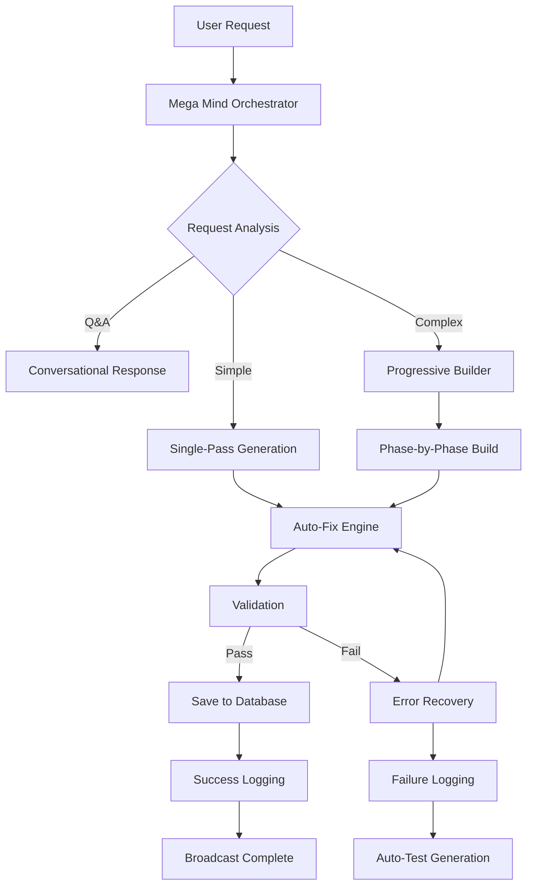
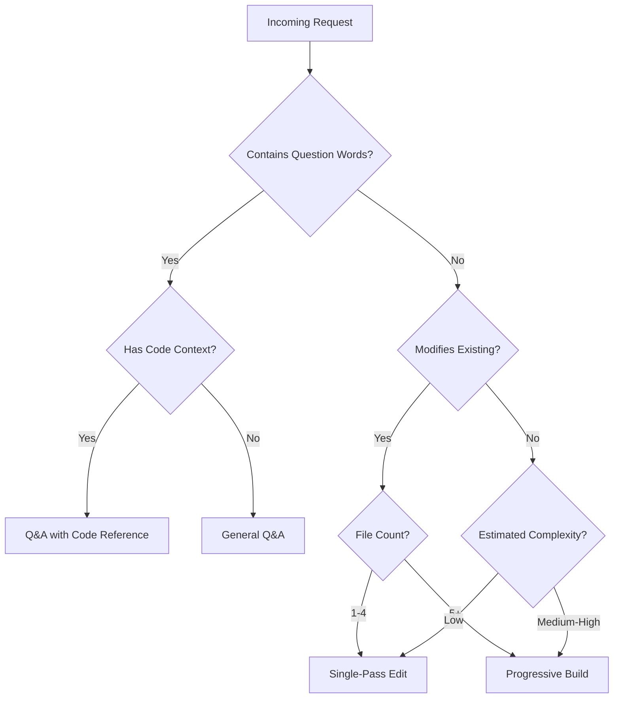
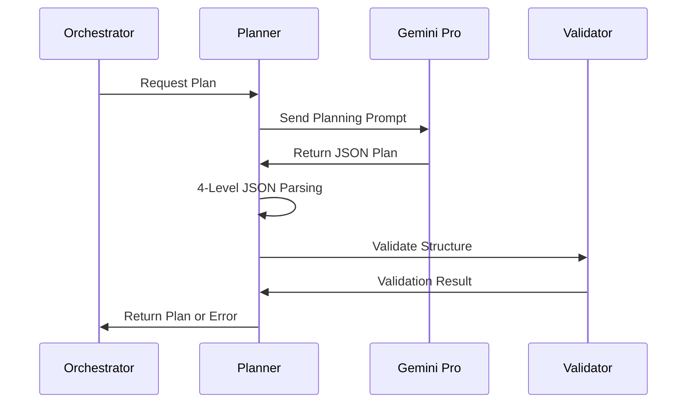
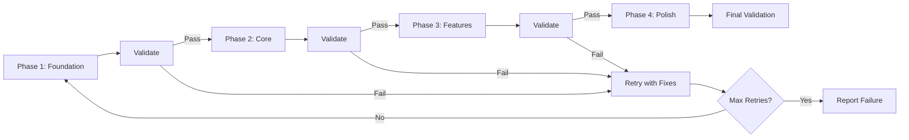
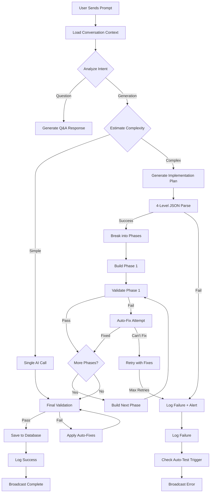

# Mega Mind Orchestrator - Complete Architecture

**Version:** 1.0  
**Last Updated:** 2025-01-10  
**Status:** Production

---

## 🎯 Overview

The Mega Mind Orchestrator is the central intelligence system that coordinates all AI-powered code generation workflows. It acts as the brain of the platform, making decisions about how to handle user requests, managing complex multi-phase builds, and ensuring reliable delivery.

---

## 🏗️ System Architecture

### Core Components



### Module Structure

```
mega-mind-orchestrator/
├── index.ts                    # Main orchestration logic
├── autoFixIntegration.ts       # Code validation & fixes
├── productionMonitoring.ts     # Success/failure tracking
└── _shared/
    ├── aiHelpers.ts           # AI calls with fallback
    ├── implementationPlanner.ts # Plan generation + JSON parsing
    ├── progressiveBuilder.ts   # Multi-phase building
    ├── codeValidator.ts       # Syntax & structure validation
    └── conversationMemory.ts  # Context management
```

---

## 🧠 Intelligence Layers

### Layer 1: Request Analysis

**Purpose:** Understand user intent and classify request type

**Decision Tree:**


**Classification Logic:**
```typescript
interface RequestClassification {
  type: 'question' | 'generation' | 'modification';
  complexity: 'simple' | 'medium' | 'complex';
  estimatedFiles: number;
  requiresPlanning: boolean;
  framework: 'react' | 'html' | 'vue';
}
```

**Implementation:** `supabase/functions/mega-mind-orchestrator/index.ts` (lines 50-120)

---

### Layer 2: Context Management

**Purpose:** Load and maintain conversation history for AI context

**Context Strategy:**
- Last 10 messages for continuity
- Project metadata (framework, file count)
- User preferences and patterns
- Previously approved architecture plans

**Memory Window:**
```typescript
const contextWindow = {
  messages: last10Messages,
  currentProject: projectMetadata,
  approvedPlans: architecturePlans,
  userPatterns: learnedPreferences,
  maxTokens: 8000 // Prevent context overflow
}
```

**Implementation:** `supabase/functions/_shared/conversationMemory.ts`

---

### Layer 3: Planning Engine

**Purpose:** Generate implementation plans for complex projects

**Plan Generation Flow:**


**Plan Structure:**
```typescript
interface ImplementationPlan {
  overview: string;
  phases: Phase[];
  estimatedDuration: number;
  dependencies: string[];
  risks: string[];
}

interface Phase {
  phaseNumber: number;
  name: string;
  files: FileDefinition[];
  dependencies: string[];
  estimatedTime: number;
}
```

**4-Level JSON Parsing Fallback:**
1. **Level 1:** Standard `JSON.parse()`
2. **Level 2:** JSON repair with `fix-json` library
3. **Level 3:** Extract from markdown code blocks
4. **Level 4:** Parse largest valid JSON chunk

**Implementation:** `supabase/functions/_shared/implementationPlanner.ts`

---

### Layer 4: Progressive Builder

**Purpose:** Build complex projects phase-by-phase with validation

**Build Strategy:**


**Phase Rules:**
- Max 20 files per phase
- Each phase builds on validated previous phase
- Real-time progress broadcasting per file
- Automatic dependency resolution

**File-by-File Generation:**
```typescript
for (const file of phaseFiles) {
  // Broadcast: "🧩 Building UserCard.tsx (3/20)"
  const generatedFile = await generateFile({
    filename: file.filename,
    description: file.description,
    dependencies: file.dependencies,
    previousFiles: validatedFiles
  });
  
  // Validate immediately
  const validation = await validateFile(generatedFile);
  if (!validation.valid) {
    // Retry with fixes
    generatedFile = await fixAndRegenerate(generatedFile, validation.issues);
  }
  
  validatedFiles.push(generatedFile);
  
  // Broadcast progress
  broadcastProgress({
    phase: currentPhase,
    fileNumber: currentFileIndex,
    totalFiles: phaseFiles.length,
    fileName: file.filename
  });
}
```

**Implementation:** `supabase/functions/_shared/progressiveBuilder.ts`

---

### Layer 5: Auto-Fix Engine

**Purpose:** Validate and automatically fix generated code

**Validation Checks:**
- ✅ Syntax validation (TypeScript/JavaScript)
- ✅ Import statement resolution
- ✅ Component structure validation
- ✅ Hook usage rules (React)
- ✅ Missing dependency detection
- ✅ Circular dependency detection

**Fix Strategies:**
```typescript
interface AutoFixStrategy {
  issueType: string;
  detection: (code: string) => boolean;
  fix: (code: string) => string;
  confidence: number;
}

const fixStrategies: AutoFixStrategy[] = [
  {
    issueType: 'missing-import',
    detection: (code) => /useState|useEffect/.test(code) && !/import.*react/i.test(code),
    fix: (code) => `import React, { useState, useEffect } from 'react';\n${code}`,
    confidence: 0.95
  },
  // ... more strategies
];
```

**Implementation:** `supabase/functions/_shared/autoFixEngine.ts`

---

## ⚡ Real-Time Communication

### Broadcast System

**Channel Structure:**
```typescript
const channelName = `ai-status-${projectId}`;

// Event Types
type BroadcastEvent = 
  | 'status-update'      // Progress updates
  | 'generation:complete' // Success
  | 'generation:error'    // Failure
  | 'generation:timeout'  // Timeout
```

**Event Payloads:**
```typescript
// Progress Update
{
  type: 'broadcast',
  event: 'status-update',
  payload: {
    status: 'generating',
    progress: 45,
    message: '🧩 Building UserCard.tsx',
    file: 'UserCard.tsx',
    fileNumber: 3,
    totalFiles: 20,
    phase: 2,
    totalPhases: 4
  }
}

// Completion
{
  type: 'broadcast',
  event: 'generation:complete',
  payload: {
    success: true,
    files: FileDefinition[],
    framework: 'react',
    duration: 45000
  }
}

// Error
{
  type: 'broadcast',
  event: 'generation:error',
  payload: {
    error: 'Failed to generate component',
    errorType: 'validation_error',
    category: 'syntax_error',
    recoverable: true
  }
}
```

---

## 🛡️ Protection Systems

### 1. Timeout Protection

**Problem:** Infinite loops or stuck generations

**Solution:** Hard 5-minute timeout with graceful shutdown

```typescript
const TIMEOUT_MS = 5 * 60 * 1000; // 5 minutes

const timeoutPromise = new Promise((_, reject) => {
  setTimeout(() => {
    reject(new Error('Generation timed out after 5 minutes'));
  }, TIMEOUT_MS);
});

try {
  await Promise.race([
    generateProject(request),
    timeoutPromise
  ]);
} catch (error) {
  if (error.message.includes('timed out')) {
    // Broadcast timeout event
    broadcastTimeout(projectId);
    // Log for analysis
    await logTimeout(request);
  }
}
```

### 2. Rate Limiting

**Prevent:** API abuse and cost overruns

**Limits:**
- 10 generations per user per hour
- 100 generations per user per day
- Circuit breaker for repeated failures

### 3. Error Recovery

**Automatic Retry Logic:**
```typescript
const MAX_RETRIES = 3;
let attempts = 0;

while (attempts < MAX_RETRIES) {
  try {
    return await generateWithAI(prompt);
  } catch (error) {
    attempts++;
    if (attempts >= MAX_RETRIES) throw error;
    
    // Exponential backoff
    await sleep(1000 * Math.pow(2, attempts));
    
    // Try with simpler prompt or different model
    prompt = simplifyPrompt(prompt);
  }
}
```

---

## 📊 Monitoring & Analytics

### Success Tracking

**Logged Metrics:**
```typescript
interface SuccessMetrics {
  fileCount: number;
  duration: number;
  framework: string;
  phases?: number;
  retries: number;
  autoFixesApplied: number;
  finalValidationScore: number;
}
```

**Storage:** `generation_analytics` table

### Failure Tracking

**Categorized Errors:**
- `ai_timeout` - AI took too long
- `validation_error` - Generated code failed validation
- `syntax_error` - Invalid syntax
- `dependency_error` - Missing/circular dependencies
- `rate_limit` - API rate limit hit
- `unknown` - Uncategorized

**Auto-Test Trigger:** After 3+ occurrences of same error in 7 days

**Storage:** `generation_failures` table

### Health Metrics

**Real-Time Calculation:**
```sql
SELECT 
  COUNT(*) FILTER (WHERE success = false) as failures,
  COUNT(*) as total,
  (COUNT(*) FILTER (WHERE success = false)::float / COUNT(*)) * 100 as failure_rate
FROM generation_analytics
WHERE created_at > now() - interval '1 hour';
```

**Alert Threshold:** >50% failure rate with 5+ attempts

---

## 🔄 Decision Flow

### Complete Generation Flow



---

## 🎓 Learning System

### Pattern Recognition

**What Gets Learned:**
- Successful fix patterns
- Common error combinations
- User preferences by framework
- Optimal phase breakdowns
- Effective retry strategies

**Storage:** `ai_knowledge_base` table

**Application:** Future requests benefit from learned patterns

---

## 🔧 Configuration

### AI Model Selection

**Decision Logic:**
```typescript
function selectModel(request: GenerationRequest): AIModel {
  if (request.requiresReasoning) {
    return 'google/gemini-2.5-pro'; // Complex reasoning
  }
  if (request.isSimple) {
    return 'google/gemini-2.5-flash-lite'; // Fast & cheap
  }
  return 'google/gemini-2.5-flash'; // Balanced default
}
```

### Timeout Values

- Single-pass generation: 2 minutes
- Progressive build: 5 minutes
- Auto-fix attempt: 30 seconds
- AI response: 60 seconds

---

## 📚 Related Documentation

- `GENERATION_FLOW.md` - Complete user journey
- `SELF_HEALING_SYSTEM.md` - Error recovery architecture
- `PLATFORM_STATUS.md` - Overall platform state

---

**Next Review:** When major architectural changes are needed
