# Mega Mind Orchestrator - Complete Architecture

**Version:** 3.0 (Intelligence-Integrated)  
**Last Updated:** 2025-01-10  
**Status:** Production with Autonomous Healing

---

## 🎯 Overview

The Mega Mind Orchestrator is the central intelligence system that coordinates all AI-powered code generation workflows. It integrates **context-aware analysis** and **autonomous decision-making** to intelligently handle user requests, manage complex multi-phase builds, and automatically fix errors with high confidence.

**Key Enhancement**: Now includes **Intelligence Engine** integration that:
- Analyzes context before every generation
- Makes intelligent decisions about auto-fix vs suggestions
- Learns from every interaction through pattern evolution
- Autonomously triggers healing when confidence is high (≥75%)

---

## 🏗️ System Architecture

### Core Components

```mermaid
graph TD
    A[User Request] --> B[Mega Mind Orchestrator]
    B --> C[🧠 Intelligence Engine]
    C --> D{Context Analysis}
    D --> E{Request Analysis}
    
    E -->|Q&A| F[Conversational Response]
    E -->|Simple| G[Single-Pass Generation]
    E -->|Complex| H[Progressive Builder]
    
    G --> I[Auto-Fix Engine]
    H --> J[Phase-by-Phase Build]
    J --> I
    
    I --> K[Validation]
    K -->|Pass| L[Save to Database]
    K -->|Fail| M[Error Classification]
    
    M --> N{🧠 Intelligent Decision}
    N -->|auto_fix 85%+| O[🤖 Autonomous Healing]
    N -->|suggest_fix 70%+| P[Suggest Fixes]
    N -->|options| Q[Provide Options]
    N -->|clarify| R[Ask User]
    
    O --> S[Pattern Evolution]
    L --> T[Success Logging]
    M --> U[Failure Logging]
    
    T --> V[Broadcast Complete]
    U --> W[🧠 Check for Auto-Heal]
    W --> N
    
    style C fill:#e1f5ff
    style N fill:#e1f5ff
    style O fill:#c8e6c9
```



### Module Structure

```
mega-mind-orchestrator/
├── index.ts                    # Main orchestration (~1,300 lines with intelligence)
├── autoFixIntegration.ts       # Code validation & fixes
├── productionMonitoring.ts     # Success/failure tracking
└── _shared/
    ├── aiHelpers.ts           # AI calls with fallback
    ├── intelligenceEngine.ts  # 🧠 Context analysis + AGI decisions
    ├── implementationPlanner.ts # Plan generation + JSON parsing
    ├── progressiveBuilder.ts   # Multi-phase building
    ├── codeValidator.ts       # Syntax & structure validation
    ├── patternLearning.ts     # Pattern evolution (Bayesian)
    └── conversationMemory.ts  # Context management
```

---

## 🧠 Intelligence Layers

### Layer 1: Request Analysis

**Purpose:** Understand user intent and classify request type

**Decision Tree:**


**Classification Logic:**
```typescript
interface RequestClassification {
  type: 'question' | 'generation' | 'modification';
  complexity: 'simple' | 'medium' | 'complex';
  estimatedFiles: number;
  requiresPlanning: boolean;
  framework: 'react' | 'html' | 'vue';
}
```

**Implementation:** `supabase/functions/mega-mind-orchestrator/index.ts` (lines 50-120)

---

### Layer 2: Context Management

**Purpose:** Load and maintain conversation history for AI context

**Context Strategy:**
- Last 10 messages for continuity
- Project metadata (framework, file count)
- User preferences and patterns
- Previously approved architecture plans

**Memory Window:**
```typescript
const contextWindow = {
  messages: last10Messages,
  currentProject: projectMetadata,
  approvedPlans: architecturePlans,
  userPatterns: learnedPreferences,
  maxTokens: 8000 // Prevent context overflow
}
```

**Implementation:** `supabase/functions/_shared/conversationMemory.ts`

---

### Layer 3: Planning Engine

**Purpose:** Generate implementation plans for complex projects

**Plan Generation Flow:**


**Plan Structure:**
```typescript
interface ImplementationPlan {
  overview: string;
  phases: Phase[];
  estimatedDuration: number;
  dependencies: string[];
  risks: string[];
}

interface Phase {
  phaseNumber: number;
  name: string;
  files: FileDefinition[];
  dependencies: string[];
  estimatedTime: number;
}
```

**4-Level JSON Parsing Fallback:**
1. **Level 1:** Standard `JSON.parse()`
2. **Level 2:** JSON repair with `fix-json` library
3. **Level 3:** Extract from markdown code blocks
4. **Level 4:** Parse largest valid JSON chunk

**Implementation:** `supabase/functions/_shared/implementationPlanner.ts`

---

### Layer 4: Progressive Builder

**Purpose:** Build complex projects phase-by-phase with validation

**Build Strategy:**


**Phase Rules:**
- Max 20 files per phase
- Each phase builds on validated previous phase
- Real-time progress broadcasting per file
- Automatic dependency resolution

**File-by-File Generation:**
```typescript
for (const file of phaseFiles) {
  // Broadcast: "🧩 Building UserCard.tsx (3/20)"
  const generatedFile = await generateFile({
    filename: file.filename,
    description: file.description,
    dependencies: file.dependencies,
    previousFiles: validatedFiles
  });
  
  // Validate immediately
  const validation = await validateFile(generatedFile);
  if (!validation.valid) {
    // Retry with fixes
    generatedFile = await fixAndRegenerate(generatedFile, validation.issues);
  }
  
  validatedFiles.push(generatedFile);
  
  // Broadcast progress
  broadcastProgress({
    phase: currentPhase,
    fileNumber: currentFileIndex,
    totalFiles: phaseFiles.length,
    fileName: file.filename
  });
}
```

**Implementation:** `supabase/functions/_shared/progressiveBuilder.ts`

---

### Layer 5: Auto-Fix Engine

**Purpose:** Validate and automatically fix generated code

**Validation Checks:**
- ✅ Syntax validation (TypeScript/JavaScript)
- ✅ Import statement resolution
- ✅ Component structure validation
- ✅ Hook usage rules (React)
- ✅ Missing dependency detection
- ✅ Circular dependency detection

**Fix Strategies:**
```typescript
interface AutoFixStrategy {
  issueType: string;
  detection: (code: string) => boolean;
  fix: (code: string) => string;
  confidence: number;
}

const fixStrategies: AutoFixStrategy[] = [
  {
    issueType: 'missing-import',
    detection: (code) => /useState|useEffect/.test(code) && !/import.*react/i.test(code),
    fix: (code) => `import React, { useState, useEffect } from 'react';\n${code}`,
    confidence: 0.95
  },
  // ... more strategies
];
```

**Implementation:** `supabase/functions/_shared/autoFixEngine.ts`

---

## ⚡ Real-Time Communication

### Broadcast System

**Channel Structure:**
```typescript
const channelName = `ai-status-${projectId}`;

// Event Types
type BroadcastEvent = 
  | 'status-update'      // Progress updates
  | 'generation:complete' // Success
  | 'generation:error'    // Failure
  | 'generation:timeout'  // Timeout
```

**Event Payloads:**
```typescript
// Progress Update
{
  type: 'broadcast',
  event: 'status-update',
  payload: {
    status: 'generating',
    progress: 45,
    message: '🧩 Building UserCard.tsx',
    file: 'UserCard.tsx',
    fileNumber: 3,
    totalFiles: 20,
    phase: 2,
    totalPhases: 4
  }
}

// Completion
{
  type: 'broadcast',
  event: 'generation:complete',
  payload: {
    success: true,
    files: FileDefinition[],
    framework: 'react',
    duration: 45000
  }
}

// Error
{
  type: 'broadcast',
  event: 'generation:error',
  payload: {
    error: 'Failed to generate component',
    errorType: 'validation_error',
    category: 'syntax_error',
    recoverable: true
  }
}
```

---

## 🛡️ Protection Systems

### 1. Timeout Protection

**Problem:** Infinite loops or stuck generations

**Solution:** Hard 5-minute timeout with graceful shutdown

```typescript
const TIMEOUT_MS = 5 * 60 * 1000; // 5 minutes

const timeoutPromise = new Promise((_, reject) => {
  setTimeout(() => {
    reject(new Error('Generation timed out after 5 minutes'));
  }, TIMEOUT_MS);
});

try {
  await Promise.race([
    generateProject(request),
    timeoutPromise
  ]);
} catch (error) {
  if (error.message.includes('timed out')) {
    // Broadcast timeout event
    broadcastTimeout(projectId);
    // Log for analysis
    await logTimeout(request);
  }
}
```

### 2. Rate Limiting

**Prevent:** API abuse and cost overruns

**Limits:**
- 10 generations per user per hour
- 100 generations per user per day
- Circuit breaker for repeated failures

### 3. Error Recovery

**Automatic Retry Logic:**
```typescript
const MAX_RETRIES = 3;
let attempts = 0;

while (attempts < MAX_RETRIES) {
  try {
    return await generateWithAI(prompt);
  } catch (error) {
    attempts++;
    if (attempts >= MAX_RETRIES) throw error;
    
    // Exponential backoff
    await sleep(1000 * Math.pow(2, attempts));
    
    // Try with simpler prompt or different model
    prompt = simplifyPrompt(prompt);
  }
}
```

---

## 📊 Monitoring & Analytics

### Success Tracking

**Logged Metrics:**
```typescript
interface SuccessMetrics {
  fileCount: number;
  duration: number;
  framework: string;
  phases?: number;
  retries: number;
  autoFixesApplied: number;
  finalValidationScore: number;
}
```

**Storage:** `generation_analytics` table

### Failure Tracking

**Categorized Errors:**
- `ai_timeout` - AI took too long
- `validation_error` - Generated code failed validation
- `syntax_error` - Invalid syntax
- `dependency_error` - Missing/circular dependencies
- `rate_limit` - API rate limit hit
- `unknown` - Uncategorized

**Auto-Test Trigger:** After 3+ occurrences of same error in 7 days

**Storage:** `generation_failures` table

### Health Metrics

**Real-Time Calculation:**
```sql
SELECT 
  COUNT(*) FILTER (WHERE success = false) as failures,
  COUNT(*) as total,
  (COUNT(*) FILTER (WHERE success = false)::float / COUNT(*)) * 100 as failure_rate
FROM generation_analytics
WHERE created_at > now() - interval '1 hour';
```

**Alert Threshold:** >50% failure rate with 5+ attempts

---

## 🔄 Decision Flow

### Complete Generation Flow


---

## 🧠 Intelligence Engine Layer (NEW)

### Overview

The Intelligence Engine adds **context-aware decision making** and **autonomous healing** to the orchestrator. It analyzes every request, makes intelligent decisions about error handling, and learns from every interaction.

**Location:** `supabase/functions/_shared/intelligenceEngine.ts`

### Context Analysis Function

**Purpose:** Analyze user intent, project state, and patterns before making decisions

```typescript
interface ContextAnalysis {
  userIntent: 'fix' | 'generate' | 'modify' | 'question' | 'explore';
  complexity: 'simple' | 'moderate' | 'complex';
  confidenceScore: number;  // 0-1
  projectState: {
    hasAuth: boolean;
    hasDatabase: boolean;
    recentErrors: number;
    successRate: number;
    generationHistory: any[];
  };
  patterns: {
    commonIssues: string[];
    userPreferences: string[];
    successfulApproaches: string[];
  };
  contextQuality: number;  // 0-100
}

// Called in orchestrator (lines 536-558)
const contextAnalysis = await analyzeContext(
  platformSupabase,
  conversationId,
  userId,
  request,
  projectId
);

// Stored for later use
(conversationContext as any)._contextAnalysis = contextAnalysis;
```

### Intelligent Decision Function

**Purpose:** Decide the best action based on context and error state

```typescript
interface IntelligentDecision {
  action: 'auto_fix' | 'suggest_fix' | 'provide_options' | 'ask_clarification';
  confidence: number;        // 0-1
  reasoning: string;
  requiresUserInput: boolean;
  suggestedApproaches: string[];
  estimatedComplexity: 'low' | 'medium' | 'high';
  riskLevel: 'low' | 'medium' | 'high';
  alternativeApproaches: string[];
}

// Called when error occurs (lines 234-238)
const decision = makeIntelligentDecision(
  contextAnalysis,
  errorSeverity,      // 'low' | 'medium' | 'high'
  hasLearnedPattern   // boolean
);
```

### Decision Logic

```typescript
Decision Criteria:
├─ Confidence ≥ 85% + Learned Pattern → auto_fix
├─ Confidence ≥ 70% → suggest_fix
├─ Complexity = complex OR Confidence < 70% → provide_options
└─ Intent unclear → ask_clarification

Confidence Calculation:
- Base: context quality / 100
- +20% if learned pattern exists
- +10% if recent successes high
- -10% per recent error
- -20% if complexity = complex
```

### Integration with Orchestrator

**1. Request Analysis (Lines 536-558)**
```typescript
// Run context analysis BEFORE generation
const contextAnalysis = await analyzeContext(...);
(conversationContext as any)._contextAnalysis = contextAnalysis;

console.log('📊 Context Analysis:', {
  intent: contextAnalysis.userIntent,
  complexity: contextAnalysis.complexity,
  confidence: contextAnalysis.confidenceScore
});
```

**2. Error Handling (Lines 182-294)**
```typescript
// When generation fails:
catch (error) {
  // Classify error
  const errorClassification = classifyError(error);
  
  // Check for learned patterns
  const { data: matchingPatterns } = await platformSupabase
    .from('universal_error_patterns')
    .select('*')
    .eq('error_category', errorClassification.category)
    .gte('confidence_score', 0.7);
  
  const hasLearnedPattern = !!(matchingPatterns?.length);
  
  // Get context (from earlier analysis or fetch fresh)
  const contextAnalysis = (conversationContext as any)._contextAnalysis || 
    await analyzeContext(...);
  
  // Make intelligent decision
  const decision = makeIntelligentDecision(
    contextAnalysis,
    errorSeverity,
    hasLearnedPattern
  );
  
  // If confident, trigger autonomous fix
  if (decision.action === 'auto_fix' && decision.confidence >= 0.75) {
    await platformSupabase.functions.invoke('unified-healing-engine', {
      body: {
        operation: 'autonomous_fix',
        params: { errorId, userId, projectId, ... }
      }
    });
    
    // Notify UI
    await broadcast('healing:triggered', {
      status: 'healing',
      message: '🤖 AI is autonomously fixing the issue...',
      decision
    });
  }
}
```

### Benefits

1. **Context-Aware**: Decisions based on project state, user intent, patterns
2. **Autonomous**: Auto-fixes errors when confident (≥75%)
3. **Learning**: Gets smarter with every fix through pattern evolution
4. **Transparent**: Reasoning provided for every decision
5. **Safe**: Risk levels prevent dangerous auto-fixes

---

## 🎓 Learning System

### Pattern Recognition

**What Gets Learned:**
- Successful fix patterns
- Common error combinations
- User preferences by framework
- Optimal phase breakdowns
- Effective retry strategies

**Storage:** `ai_knowledge_base` table

**Application:** Future requests benefit from learned patterns

---

## 🔧 Configuration

### AI Model Selection

**Decision Logic:**
```typescript
function selectModel(request: GenerationRequest): AIModel {
  if (request.requiresReasoning) {
    return 'google/gemini-2.5-pro'; // Complex reasoning
  }
  if (request.isSimple) {
    return 'google/gemini-2.5-flash-lite'; // Fast & cheap
  }
  return 'google/gemini-2.5-flash'; // Balanced default
}
```

### Timeout Values

- Single-pass generation: 2 minutes
- Progressive build: 5 minutes
- Auto-fix attempt: 30 seconds
- AI response: 60 seconds

---

## 📚 Related Documentation

- `GENERATION_FLOW.md` - Complete user journey
- `SELF_HEALING_SYSTEM.md` - Error recovery architecture
- `PLATFORM_STATUS.md` - Overall platform state

---

**Next Review:** When major architectural changes are needed
