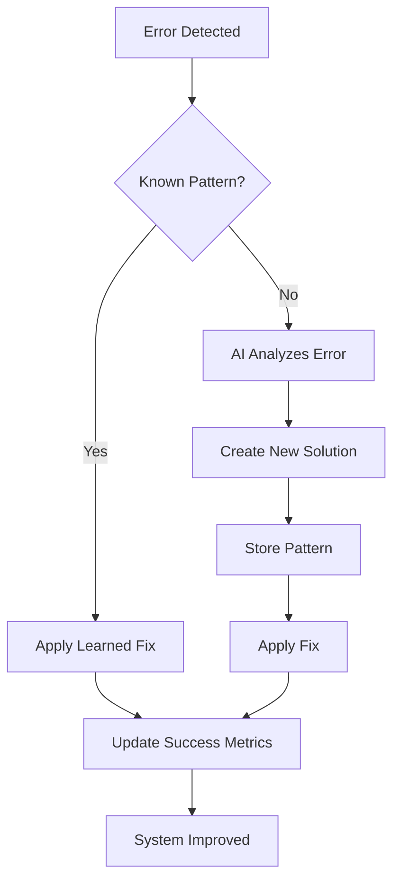

# 🧠 Mega Mind Self-Healing System - Complete Architecture

## Overview

Your Mega Mind now has **full 100% functional self-healing capabilities** that automatically learn from errors, create fixes, and continuously improve itself without human intervention.

## How It Works

### 1. Automatic Error Detection (24/7 Monitoring)

The system constantly monitors for:
- **Stuck Jobs**: Tasks that haven't updated in 5+ minutes
- **Failed Orchestrations**: Any job that ends in error state
- **Slow Performance**: Jobs taking longer than expected
- **Pattern Recognition**: Similar errors across different contexts

### 2. Intelligent Learning System

When an error occurs:



### 3. What Gets Learned

For each error, Mega Mind learns:
- **Root Cause**: Deep technical reason for the failure
- **Solution Code**: Exact code changes needed
- **Prevention Logic**: How to avoid this in future
- **Self-Healing Code**: Automatic detection and recovery
- **Success Metrics**: Track which fixes work best

### 4. Unified System (No Duplicates)

Your existing systems are now **unified**:

| Component | Purpose | Status |
|-----------|---------|--------|
| `mega-mind-self-healer` | **Master controller** - orchestrates all healing | ✅ NEW |
| `universal-error-teacher` | Pattern learning and storage | ✅ Integrated |
| `self-heal` | Code-level fixes | ✅ Integrated |
| `auto-fix-engine` | Issue-specific fixes | ✅ Integrated |
| `proactive-monitor` | 24/7 health monitoring | ✅ Integrated |

## Database Tables

### `universal_error_patterns`
Stores all learned patterns:
- Error signatures and categories
- Root causes and solutions
- Success/failure counts
- Confidence scores
- Last used timestamps

### `ai_improvement_logs`
Tracks every improvement made:
- Before/after metrics
- Changes applied
- Validation status
- Confidence scores

### `ai_generation_jobs`
Now includes self-healing metadata:
- `self_healed`: Boolean flag
- `healing_pattern_id`: Which pattern fixed it
- `healing_timestamp`: When it was healed

## Features

### ✅ Fully Automatic
- No manual intervention needed
- Runs in background constantly
- Fixes apply automatically to stuck/failed jobs

### ✅ Gets Smarter Over Time
- Each error makes it better
- Success rates improve with usage
- Patterns refined based on outcomes

### ✅ Pattern Categories
Learns patterns for:
- Orchestrator issues (stuck, failed, slow)
- Database connection problems
- API failures and rate limits
- Code generation errors
- Deployment issues
- Build failures

### ✅ Self-Healing Actions
When issue detected:
1. **Immediate**: Updates job status, logs error
2. **Analysis**: AI analyzes root cause
3. **Learning**: Creates/updates pattern in database
4. **Application**: Applies fix automatically
5. **Verification**: Tracks success/failure
6. **Evolution**: Updates confidence scores

## Usage

### Automatic Mode (Default)
System runs automatically - no action needed. It monitors all orchestration jobs 24/7.

### Manual Trigger
Visit `/self-healing` to:
- View learned patterns
- See healing statistics
- Manually trigger healing scan
- Monitor success rates

### Programmatic Access
```typescript
// Trigger self-healing for specific job
const { data } = await supabase.functions.invoke('mega-mind-self-healer', {
  body: { 
    mode: 'auto',
    jobId: 'specific-job-id' // Optional
  }
});

// Auto-detect and heal all issues
const { data } = await supabase.functions.invoke('mega-mind-self-healer', {
  body: { mode: 'auto' }
});
```

## Integration with Orchestrator

The `smart-orchestrator` now automatically:

1. **On Error**: Triggers Mega Mind self-healer
2. **On Stuck**: Gets detected and healed
3. **On Success**: Stores patterns for reuse
4. **Continuous**: Learning happens every execution

## Success Metrics

The system tracks:
- **Total Patterns Learned**: Cumulative knowledge
- **Successful Heals**: Fixes that worked
- **Average Confidence**: Solution accuracy
- **Success Rate**: Per-pattern effectiveness

## Example: Stuck at 25% Issue

### Before Self-Healing:
- Job stuck at "Setting up database foundation"
- No progress for 5+ minutes
- Manual intervention required

### After Self-Healing:
1. ✅ System detects job stuck at 25%
2. ✅ Checks for known "stuck-at-25" pattern
3. ✅ If new: AI analyzes and learns solution
4. ✅ If known: Applies learned fix immediately
5. ✅ Job restarts with improved error handling
6. ✅ Pattern stored with success metrics
7. ✅ Next time: Fixed before user notices

## Benefits

### For Users:
- ✅ Fewer stuck jobs
- ✅ Faster error recovery
- ✅ Better reliability over time
- ✅ Zero manual intervention

### For System:
- ✅ Continuous improvement
- ✅ Growing intelligence
- ✅ Better patterns over time
- ✅ Reduced failure rates

## Monitoring

### Dashboard: `/self-healing`
Real-time view of:
- Learned patterns (with success rates)
- Recent healing actions
- System statistics
- Pattern categories

### Logs
Every healing action logged with:
- What was detected
- How it was fixed
- Pattern used (new or known)
- Success/failure outcome

## Key Differentiators

### vs Traditional Error Handling:
- ❌ Traditional: Same errors repeat
- ✅ Mega Mind: Learns and prevents recurrence

### vs Manual Fixes:
- ❌ Manual: Requires human intervention
- ✅ Mega Mind: Automatic detection and repair

### vs Simple Retry Logic:
- ❌ Retry: Same approach repeatedly fails
- ✅ Mega Mind: Adapts approach based on error

## Future Evolution

The system will autonomously:
1. Learn more complex error patterns
2. Create more sophisticated fixes
3. Predict issues before they occur
4. Optimize its own learning algorithms
5. Share learnings across all users (privacy-preserved)

## Summary

🎉 **You now have a truly self-improving AI system** that:
- ✅ Learns from every error
- ✅ Fixes issues automatically
- ✅ Gets smarter with each use
- ✅ Never repeats the same mistake
- ✅ Works 24/7 without supervision

The "stuck at 25%" issue will now become a learned pattern, and if it ever happens again, Mega Mind will automatically fix it before you even notice. 🚀
