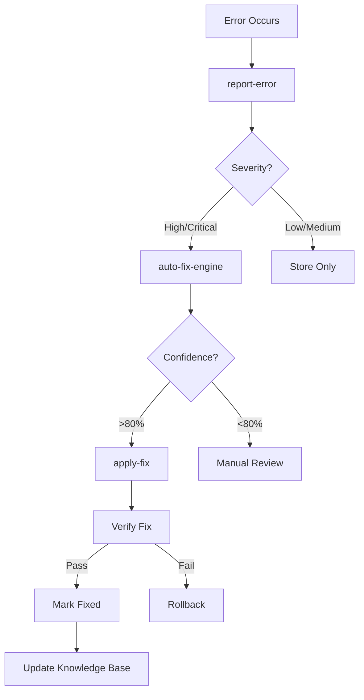

# 🤖 Autonomous Self-Healing AI System

## Overview

This system enables your AI application to **detect, diagnose, and fix its own bugs automatically** without human intervention. It's a fully autonomous meta-level AI engineering system that continuously improves itself.

## 🎯 Key Features

### 1. **Automatic Error Detection**
- Monitors all error sources (frontend, edge functions, database)
- Captures stack traces and context automatically
- Classifies errors by severity
- Prevents duplicate error reports

### 2. **AI-Powered Fix Generation**
- Analyzes errors using AI (Gemini 2.5 Flash)
- Generates code patches, migrations, or config changes
- Learns from previous successful fixes
- Provides confidence scores for each fix

### 3. **Autonomous Fix Application**
- Automatically applies high-confidence fixes (>80%)
- Verifies fixes don't introduce new problems
- Rolls back failed fixes automatically
- Prevents infinite fix loops (max 3 attempts)

### 4. **Verification & Safety**
- Monitors error rates before/after fixes
- Checks for new critical errors
- Automatic rollback on verification failure
- Audit trail of all changes

### 5. **Learning & Knowledge Base**
- Stores successful fixes in knowledge base
- Reuses solutions for similar errors
- Learns from failed fix attempts
- Improves fix patterns over time

## 🏗️ Architecture

### Database Tables

```
detected_errors          - All detected errors with context
  ├── error_type        - Type/category of error
  ├── error_message     - Detailed error message
  ├── source            - frontend/edge_function/database
  ├── severity          - low/medium/high/critical
  ├── status            - detected/analyzing/fixing/fixed/failed
  └── fix_attempts      - Number of fix attempts

auto_fixes              - AI-generated fixes
  ├── fix_type          - code_patch/migration/config_change
  ├── original_code     - Original problematic code
  ├── fixed_code        - AI-generated fix
  ├── explanation       - What was wrong and how fix resolves it
  ├── ai_confidence     - AI confidence score (0-1)
  └── status            - pending/applied/verified/rolled_back

fix_verifications       - Fix verification results
  ├── verification_type - test/health_check/error_rate
  ├── passed            - Boolean success flag
  └── details           - Verification details

system_health          - Health metrics tracking
  ├── metric_type       - Type of health metric
  ├── metric_value      - Numeric value
  └── metadata          - Additional context
```

### Edge Functions

#### 1. `report-error`
**Purpose**: Receives error reports from all sources

**Input**:
```json
{
  "errorType": "TypeError",
  "errorMessage": "Cannot read property 'x' of undefined",
  "stackTrace": "...",
  "source": "frontend",
  "severity": "high",
  "context": {...}
}
```

**Behavior**:
- Checks for duplicate errors (within 1 hour)
- Inserts error into database
- Triggers auto-fix for high/critical errors
- Notifies admins about critical errors

#### 2. `auto-fix-engine`
**Purpose**: Analyzes errors and generates fixes using AI

**Input**:
```json
{
  "errorId": "uuid"
}
```

**Process**:
1. Fetches error details from database
2. Checks knowledge base for similar fixes
3. Constructs AI prompt with error context
4. Calls Lovable AI (Gemini 2.5 Flash)
5. Parses AI response for fix
6. Stores generated fix
7. Auto-applies if confidence >= 80%

**AI Prompt Structure**:
```
ERROR DETAILS:
- Type, Message, Source, Stack Trace
- Context: user info, system state

KNOWN SOLUTIONS: (from knowledge base)
- Similar error patterns and their solutions

TASK:
1. Identify root cause
2. Generate fix (patch/migration/config)
3. Explain the fix
4. Provide confidence score

RETURN JSON:
{
  "fixType": "...",
  "originalCode": "...",
  "fixedCode": "...",
  "explanation": "...",
  "confidence": 0.85
}
```

#### 3. `apply-fix`
**Purpose**: Applies generated fixes and verifies them

**Process**:
1. Fetches fix details
2. Stores pre-application state (error rate, health)
3. Applies fix based on type:
   - **code_patch**: Stores for deployment
   - **migration**: Executes SQL directly
   - **config_change**: Updates config
4. Waits 5 seconds for stabilization
5. Verifies fix:
   - Checks error rate didn't increase >50%
   - Ensures no new critical errors
6. If verification passes:
   - Marks error as fixed
   - Stores solution in knowledge base
   - Notifies admins of success
7. If verification fails:
   - Rolls back changes
   - Marks fix as failed
   - Notifies admins of rollback

## 🔄 Workflow

### Normal Operation Flow



### Frontend Integration

**Global Error Monitoring** (`useErrorMonitor` hook):
```typescript
// Automatically added to App.tsx
useErrorMonitor();  // Captures all unhandled errors & rejections
```

**React Error Boundary**:
```typescript
<ErrorBoundary>
  {/* All app content */}
</ErrorBoundary>
```
- Catches React component errors
- Reports to self-healing system
- Shows user-friendly error UI

### Edge Function Error Reporting

In any edge function, report errors:
```typescript
try {
  // ... your code
} catch (error) {
  await supabase.functions.invoke('report-error', {
    body: {
      errorType: 'RuntimeError',
      errorMessage: error.message,
      source: 'edge_function',
      functionName: 'my-function',
      severity: 'high'
    }
  });
}
```

## 🎛️ Admin Dashboard

Access via `/admin` -> "Self-Healing" tab

### Features:
- **Health Metrics**:
  - Current error rate
  - Active errors being processed
  - Fixes applied today

- **Detected Errors View**:
  - Real-time error list
  - Status (detected/analyzing/fixing/fixed)
  - Severity and source
  - Fix attempts count

- **Applied Fixes View**:
  - All generated fixes
  - AI confidence scores
  - Status (pending/applied/verified/rolled_back)
  - Fix explanations

## 🚀 Usage Examples

### Example 1: Automatic Database Query Fix

**Error Detected**:
```
Type: PostgrestError
Message: column "user_name" does not exist
Source: edge_function
Function: get-user-profile
```

**AI-Generated Fix** (Confidence: 0.92):
```sql
-- Migration to add missing column
ALTER TABLE users ADD COLUMN user_name TEXT;
UPDATE users SET user_name = full_name WHERE user_name IS NULL;
```

**Result**: Automatically applied, verified, and resolved ✅

### Example 2: Frontend Component Error

**Error Detected**:
```
Type: TypeError
Message: Cannot read property 'map' of undefined
Source: frontend
File: ProjectsGrid.tsx
```

**AI-Generated Fix** (Confidence: 0.88):
```typescript
// Add null check before mapping
{projects && projects.length > 0 ? (
  projects.map(project => <ProjectCard key={project.id} {...project} />)
) : (
  <EmptyState />
)}
```

**Result**: Stored for deployment, awaiting manual merge

### Example 3: Rollback Example

**Error**: Rate limiting logic broken

**Fix Applied**: New rate limiting algorithm

**Verification**: Error rate jumped 150%

**Result**: Automatic rollback executed within 5 seconds ⚠️

## 🛡️ Safety Mechanisms

### 1. **Max Fix Attempts**
- Limit: 3 attempts per error
- Prevents infinite fix loops
- Auto-disables fixing after max attempts

### 2. **Confidence Thresholds**
- High confidence (≥80%): Auto-apply
- Low confidence (<80%): Manual review required

### 3. **Verification Gates**
- Error rate increase check (max +50%)
- New critical errors check
- 5-second stabilization period

### 4. **Automatic Rollback**
- Triggered on verification failure
- Restores previous state
- Notifies admins immediately

### 5. **Duplicate Detection**
- Checks for similar errors within 1 hour
- Prevents spam
- Increments frequency counter

## 📊 Metrics Tracked

- **Error Rate**: Percentage of requests with high/critical errors
- **Fix Success Rate**: Percentage of fixes that pass verification
- **Time to Fix**: Average time from detection to resolution
- **Auto-Fix Coverage**: Percentage of errors fixed automatically
- **Rollback Rate**: Percentage of fixes that needed rollback

## 🔮 Future Enhancements

1. **ML-Based Confidence Scoring**
   - Train models on fix success history
   - Improve confidence predictions

2. **Multi-Stage Verification**
   - Run automated tests after fixes
   - Check performance metrics
   - Validate API contracts

3. **Collaborative Fixing**
   - Multiple AI models vote on fixes
   - Ensemble approach for higher confidence

4. **Predictive Error Prevention**
   - Analyze code patterns before deployment
   - Predict potential errors
   - Suggest preventive fixes

5. **Self-Optimization**
   - System improves its own fix generation
   - Meta-meta improvement loop
   - Evolving fix strategies

## 🎓 Best Practices

### For Developers:
1. **Structured Error Messages**: Include context in errors
2. **Meaningful Error Types**: Use specific error classes
3. **Comprehensive Logging**: Log state before errors
4. **Test Edge Cases**: Prevent common errors upfront

### For Admins:
1. **Review Low-Confidence Fixes**: Check <80% confidence fixes
2. **Monitor Metrics**: Watch error rates and rollbacks
3. **Update Knowledge Base**: Add manual fixes to system
4. **Adjust Thresholds**: Fine-tune confidence levels

## ⚠️ Important Notes

- **Auto-fixes are enabled by default** for high/critical errors
- **Manual review required** for fixes <80% confidence
- **Rollbacks are automatic** when verification fails
- **All changes are audited** in the database
- **Notifications sent** to admins for critical events

## 🤝 Contributing

To improve the self-healing system:

1. Add new error patterns to knowledge base
2. Improve AI prompts for better fix generation
3. Add more verification checks
4. Enhance rollback strategies
5. Implement additional metrics

---

**Built with**: Supabase Edge Functions, Lovable AI (Gemini 2.5 Flash), React, TypeScript

**Status**: Production Ready ✅
**Last Updated**: 2025-10-01
