# Self-Healing System Architecture

**Version:** 3.0 (Intelligence-Integrated)  
**Last Updated:** 2025-01-10  
**Status:** Production & Active with Autonomous Healing

---

## 🎯 Overview

The Self-Healing System is an **autonomous, context-aware recovery mechanism** that detects, analyzes, and fixes errors automatically without human intervention. It integrates with the **Intelligence Engine** to make intelligent decisions about when to auto-fix (≥75% confidence with learned patterns) versus when to suggest fixes or ask for clarification.

**Key Enhancement**: Now includes **context-aware decisions** that:
- Analyze error severity, user intent, and project state
- Match errors against learned patterns
- Autonomously trigger fixes when confidence is high
- Evolve patterns through Bayesian learning
- Broadcast healing events for UI updates

---

## 🏗️ System Layers

```mermaid
graph TD
    A[Error Detection] --> B[Classification]
    B --> C[🧠 Context Analysis]
    C --> D{Pattern Matching}
    
    D -->|Known Pattern| E[Check Confidence]
    D -->|No Pattern| F[AI Analysis]
    
    E -->|≥75% + Learned| G[🤖 Auto-Apply Fix]
    E -->|≥70%| H[Suggest Fixes]
    E -->|<70%| I[Provide Options]
    
    F --> J[Generate Fix]
    J --> H
    
    G --> K[Validate Fix]
    H --> L[User Selection]
    I --> L
    
    K -->|Success| M[📊 Pattern Evolution]
    K -->|Fail| N[Escalate]
    L --> K
    
    M --> O[Update Knowledge Base]
    N --> P[Human Review Queue]
    
    style C fill:#e1f5ff
    style G fill:#c8e6c9
    style M fill:#c8e6c9
```



---

## 🛡️ Layer 1: Robust Parsing (JSON Recovery)

### Problem Statement

**Issue:** AI models sometimes return malformed JSON, causing parsing failures

**Impact:** 
- Generation failures
- Wasted API calls
- Poor user experience

### Solution: 4-Level Fallback Strategy

**Architecture:**


### Implementation Details

#### Level 1: Standard JSON.parse()

**Handles:** 95% of responses

```typescript
function parseLevel1(text: string): any {
  try {
    return JSON.parse(text);
  } catch (error) {
    console.log('Level 1 failed, trying Level 2...');
    throw error;
  }
}
```

#### Level 2: JSON Repair

**Handles:** Common JSON syntax errors

**Fixes:**
- Missing commas
- Trailing commas
- Unquoted keys
- Single quotes instead of double
- Missing closing brackets

```typescript
import { fixJson } from 'fix-json';

function parseLevel2(text: string): any {
  try {
    const repaired = fixJson(text);
    return JSON.parse(repaired);
  } catch (error) {
    console.log('Level 2 failed, trying Level 3...');
    throw error;
  }
}
```

#### Level 3: Markdown Code Block Extraction

**Handles:** AI wrapping JSON in markdown

**Patterns:**
- \`\`\`json ... \`\`\`
- \`\`\` ... \`\`\`
- Multiple code blocks (extracts first)

```typescript
function parseLevel3(text: string): any {
  const codeBlockRegex = /```(?:json)?\s*\n([\s\S]*?)\n```/;
  const match = text.match(codeBlockRegex);
  
  if (match && match[1]) {
    try {
      const extracted = match[1].trim();
      return JSON.parse(extracted);
    } catch (error) {
      // Try repair on extracted content
      try {
        const repaired = fixJson(match[1].trim());
        return JSON.parse(repaired);
      } catch {
        console.log('Level 3 failed, trying Level 4...');
        throw error;
      }
    }
  }
  throw new Error('No code block found');
}
```

#### Level 4: Partial/Chunk Parsing

**Handles:** Truncated responses or streaming issues

**Strategy:** Find largest valid JSON substring

```typescript
function parseLevel4(text: string): any {
  // Find all potential JSON objects/arrays
  const jsonStarts = [];
  for (let i = 0; i < text.length; i++) {
    if (text[i] === '{' || text[i] === '[') {
      jsonStarts.push(i);
    }
  }
  
  // Try parsing from each potential start
  for (const start of jsonStarts.reverse()) {
    for (let end = text.length; end > start; end--) {
      try {
        const chunk = text.substring(start, end);
        const parsed = JSON.parse(chunk);
        
        console.warn('Level 4 succeeded - partial parse', {
          chunkSize: chunk.length,
          totalSize: text.length
        });
        
        return parsed;
      } catch {
        continue;
      }
    }
  }
  
  throw new Error('All parsing levels failed');
}
```

#### Master Parser

```typescript
export async function robustJSONParse(text: string): Promise<any> {
  const levels = [
    { name: 'Standard Parse', fn: parseLevel1 },
    { name: 'JSON Repair', fn: parseLevel2 },
    { name: 'Markdown Extract', fn: parseLevel3 },
    { name: 'Partial Parse', fn: parseLevel4 }
  ];
  
  for (const level of levels) {
    try {
      console.log(`Attempting: ${level.name}`);
      const result = level.fn(text);
      console.log(`✅ ${level.name} succeeded`);
      return result;
    } catch (error) {
      console.log(`❌ ${level.name} failed`);
      continue;
    }
  }
  
  // All levels failed - log for analysis
  await logParsingFailure({
    text: text.substring(0, 500), // First 500 chars
    textLength: text.length,
    timestamp: new Date()
  });
  
  throw new Error('JSON parsing failed at all levels');
}
```

**Location:** `supabase/functions/_shared/implementationPlanner.ts`

---

## 🛡️ Layer 2: Timeout Protection

### Problem Statement

**Issue:** Generations can get stuck in infinite loops or hang indefinitely

**Impact:**
- Server resources wasted
- Users waiting forever
- No feedback

### Solution: Hard 5-Minute Timeout

**Implementation:**
```typescript
const TIMEOUT_MS = 5 * 60 * 1000; // 5 minutes

async function generateWithTimeout(request: GenerationRequest) {
  const timeoutPromise = new Promise<never>((_, reject) => {
    setTimeout(() => {
      reject(new Error('TIMEOUT'));
    }, TIMEOUT_MS);
  });
  
  const generationPromise = performGeneration(request);
  
  try {
    return await Promise.race([
      generationPromise,
      timeoutPromise
    ]);
  } catch (error) {
    if (error.message === 'TIMEOUT') {
      // Broadcast timeout to frontend
      await supabase
        .channel(`ai-status-${request.projectId}`)
        .send({
          type: 'broadcast',
          event: 'generation:timeout',
          payload: {
            status: 'error',
            message: 'Generation timed out after 5 minutes'
          }
        });
      
      // Log for analysis
      await logTimeout(request);
    }
    throw error;
  }
}
```

**Timeout Actions:**
1. **Immediate:** Cancel ongoing AI requests
2. **Broadcast:** Send timeout event to frontend
3. **Cleanup:** Release resources (database connections, etc.)
4. **Log:** Record timeout for pattern analysis
5. **Alert:** Notify admins if timeout rate is high

**Location:** `supabase/functions/mega-mind-orchestrator/index.ts`

---

## 🛡️ Layer 3: Auto-Fix Engine

### Code Validation Rules

```typescript
interface ValidationRule {
  name: string;
  check: (code: string, context: Context) => ValidationIssue[];
  severity: 'error' | 'warning';
  autoFixable: boolean;
}

const validationRules: ValidationRule[] = [
  {
    name: 'missing-react-import',
    check: (code) => {
      if (/\bReact\b/.test(code) && !/import.*React/.test(code)) {
        return [{
          type: 'missing-import',
          message: 'React is used but not imported',
          line: 1
        }];
      }
      return [];
    },
    severity: 'error',
    autoFixable: true
  },
  // ... more rules
];
```

### Auto-Fix Strategies


### Fix Application

```typescript
interface AutoFix {
  issueType: string;
  apply: (code: string, issue: ValidationIssue) => string;
  confidence: number;
}

const autoFixes: AutoFix[] = [
  {
    issueType: 'missing-import',
    apply: (code, issue) => {
      const importStatement = `import ${issue.package} from '${issue.from}';\n`;
      return importStatement + code;
    },
    confidence: 0.95
  },
  {
    issueType: 'unused-variable',
    apply: (code, issue) => {
      // Remove unused variable declaration
      return code.replace(
        new RegExp(`const ${issue.variable}.*?;`, 'g'),
        ''
      );
    },
    confidence: 0.85
  }
  // ... more fixes
];

async function applyAutoFixes(
  code: string,
  issues: ValidationIssue[]
): Promise<string> {
  let fixedCode = code;
  
  for (const issue of issues) {
    const fix = autoFixes.find(f => f.issueType === issue.type);
    
    if (fix && fix.confidence > 0.8) {
      try {
        fixedCode = fix.apply(fixedCode, issue);
        console.log(`✅ Applied auto-fix for: ${issue.type}`);
      } catch (error) {
        console.log(`❌ Auto-fix failed for: ${issue.type}`);
      }
    } else {
      // Use AI to fix
      fixedCode = await aiFixCode(fixedCode, issue);
    }
  }
  
  return fixedCode;
}
```

**Location:** `supabase/functions/_shared/autoFixEngine.ts`

---

## 🛡️ Layer 4: Pattern Learning

### Learning from Failures

**Trigger:** When same error occurs 3+ times in 7 days

**Action:** Create regression test automatically

```typescript
// Database trigger
CREATE OR REPLACE FUNCTION auto_generate_test_from_failure()
RETURNS TRIGGER AS $$
DECLARE
  failure_count INTEGER;
BEGIN
  -- Count occurrences of this error
  SELECT COUNT(*) INTO failure_count
  FROM generation_failures
  WHERE error_type = NEW.error_type
    AND created_at > now() - INTERVAL '7 days';
  
  -- Create test if threshold met
  IF failure_count >= 3 THEN
    INSERT INTO auto_generated_tests (
      test_name,
      test_type,
      test_prompt,
      expected_behavior,
      framework,
      created_from_failure_id,
      confidence_score
    ) VALUES (
      'regression_' || NEW.error_type,
      'regression',
      NEW.user_request,
      jsonb_build_object(
        'shouldNotFail', true,
        'errorType', NEW.error_type,
        'minimumFiles', 1
      ),
      NEW.framework,
      NEW.id,
      75
    );
    
    -- Mark failure as having generated test
    UPDATE generation_failures
    SET test_generated = true
    WHERE id = NEW.id;
  END IF;
  
  RETURN NEW;
END;
$$ LANGUAGE plpgsql;
```

### Pattern Storage

```typescript
interface LearnedPattern {
  patternName: string;
  errorType: string;
  fixStrategy: string;
  successRate: number;
  timesApplied: number;
  confidenceScore: number;
  lastUsed: Date;
}
```

**Storage:** `universal_error_patterns` table

### Pattern Application

```typescript
async function attemptPatternFix(
  error: GenerationError,
  code: string
): Promise<{ fixed: string; confidence: number } | null> {
  // Find matching learned pattern
  const pattern = await supabase
    .from('universal_error_patterns')
    .select('*')
    .eq('error_signature', error.signature)
    .gte('confidence_score', 0.7)
    .order('success_rate', { ascending: false })
    .limit(1)
    .single();
  
  if (!pattern.data) return null;
  
  // Apply learned fix
  const fixed = applyPattern(code, pattern.data.fix_strategy);
  
  // Validate
  const validation = await validateCode(fixed);
  
  // Update pattern stats
  await updatePatternStats(pattern.data.id, validation.passed);
  
  return {
    fixed,
    confidence: pattern.data.confidence_score
  };
}
```

---

## 🛡️ Layer 5: Circuit Breaker

### Prevents Cascading Failures

```typescript
class CircuitBreaker {
  private state: 'closed' | 'open' | 'half-open' = 'closed';
  private failures = 0;
  private lastFailTime?: Date;
  
  private readonly threshold = 5;
  private readonly timeout = 60000; // 1 minute
  
  async execute<T>(fn: () => Promise<T>): Promise<T> {
    if (this.state === 'open') {
      if (Date.now() - this.lastFailTime!.getTime() > this.timeout) {
        this.state = 'half-open';
      } else {
        throw new Error('Circuit breaker is OPEN');
      }
    }
    
    try {
      const result = await fn();
      this.onSuccess();
      return result;
    } catch (error) {
      this.onFailure();
      throw error;
    }
  }
  
  private onSuccess() {
    this.failures = 0;
    this.state = 'closed';
  }
  
  private onFailure() {
    this.failures++;
    this.lastFailTime = new Date();
    
    if (this.failures >= this.threshold) {
      this.state = 'open';
      this.sendAlert('Circuit breaker opened due to repeated failures');
    }
  }
}
```

**Usage:**
```typescript
const aiCircuitBreaker = new CircuitBreaker();

const result = await aiCircuitBreaker.execute(() => 
  callAIModel(prompt)
);
```

**Location:** `supabase/functions/_shared/circuitBreaker.ts`

---

## 📊 Health Monitoring

### Failure Rate Calculation

```typescript
async function checkSystemHealth(): Promise<HealthMetrics> {
  const { data } = await supabase.rpc('get_error_rate', {
    time_window: '1 hour'
  });
  
  return {
    failureRate: data.error_rate,
    totalAttempts: data.total_requests,
    successfulAttempts: data.total_requests - data.error_count,
    status: data.error_rate > 50 ? 'degraded' : 'healthy'
  };
}
```

### Alert Thresholds

```typescript
const alertThresholds = {
  failureRate: {
    warning: 25,  // 25% failure rate
    critical: 50   // 50% failure rate
  },
  timeoutRate: {
    warning: 10,
    critical: 20
  },
  avgDuration: {
    warning: 120, // 2 minutes
    critical: 240  // 4 minutes
  }
};
```

---

## 🔄 Recovery Strategies

### Strategy Selection


### Exponential Backoff

```typescript
async function retryWithBackoff<T>(
  fn: () => Promise<T>,
  maxRetries = 3
): Promise<T> {
  let attempt = 0;
  
  while (attempt < maxRetries) {
    try {
      return await fn();
    } catch (error) {
      attempt++;
      
      if (attempt >= maxRetries) throw error;
      
      const delay = Math.min(1000 * Math.pow(2, attempt), 10000);
      await sleep(delay);
      
      console.log(`Retry attempt ${attempt} after ${delay}ms`);
    }
  }
  
  throw new Error('Max retries exceeded');
}
```

---

## 📚 Database Schema

### Error Tracking Tables

```sql
-- Main failure log
CREATE TABLE generation_failures (
  id UUID PRIMARY KEY DEFAULT gen_random_uuid(),
  error_type TEXT NOT NULL,
  error_message TEXT NOT NULL,
  failure_category TEXT NOT NULL,
  severity TEXT NOT NULL,
  occurrence_count INTEGER DEFAULT 1,
  test_generated BOOLEAN DEFAULT false,
  stack_trace TEXT,
  framework TEXT,
  user_request TEXT,
  created_at TIMESTAMPTZ DEFAULT now()
);

-- Pattern learning
CREATE TABLE universal_error_patterns (
  id UUID PRIMARY KEY DEFAULT gen_random_uuid(),
  pattern_name TEXT NOT NULL,
  error_signature TEXT NOT NULL,
  fix_strategy JSONB NOT NULL,
  success_count INTEGER DEFAULT 0,
  failure_count INTEGER DEFAULT 0,
  confidence_score NUMERIC DEFAULT 0.5,
  last_used_at TIMESTAMPTZ,
  created_at TIMESTAMPTZ DEFAULT now()
);

-- Auto-generated tests
CREATE TABLE auto_generated_tests (
  id UUID PRIMARY KEY DEFAULT gen_random_uuid(),
  test_name TEXT NOT NULL,
  test_type TEXT NOT NULL,
  test_prompt TEXT NOT NULL,
  expected_behavior JSONB NOT NULL,
  framework TEXT NOT NULL,
  created_from_failure_id UUID REFERENCES generation_failures(id),
  confidence_score NUMERIC DEFAULT 50,
  run_count INTEGER DEFAULT 0,
  pass_count INTEGER DEFAULT 0,
  fail_count INTEGER DEFAULT 0,
  is_active BOOLEAN DEFAULT true,
  created_at TIMESTAMPTZ DEFAULT now()
);
```

---

## 🎯 Success Metrics

### Self-Healing Effectiveness

**Tracked Metrics:**
- Auto-fix success rate
- Average recovery time
- Patterns learned per week
- Reduction in human intervention
- Test coverage from failures

**Target KPIs:**
- 90%+ auto-fix success rate
- <30s average recovery time
- <5% escalation rate

---

## 📚 Related Documentation

- `MEGA_MIND_ARCHITECTURE.md` - Orchestrator design
- `GENERATION_FLOW.md` - Complete generation journey
- `PLATFORM_STATUS.md` - Overall system state

---

**Last Validated:** 2025-01-10  
**Next Review:** When significant healing failures occur
