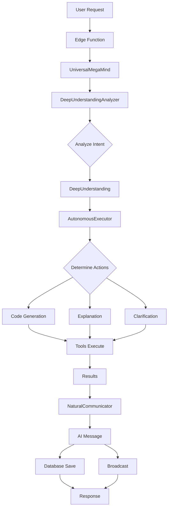

# Enterprise AI Architecture - Universal Mega Mind

## Overview

The Universal Mega Mind system provides autonomous AI-driven development with true understanding of user intent. This is an enterprise-grade, production-ready architecture built on autonomous reasoning principles.

---

## Core Architecture

### **Unified Entry Point**
```
User Request → Edge Function → UniversalMegaMind → Response
```

### **Intelligence Layer Components**

#### 1. **UniversalMegaMind** (`intelligence/index.ts`)
**Role**: Main orchestration controller

**Responsibilities**:
- Coordinates all intelligence components
- Manages conversation flow
- Handles error recovery
- Provides unified interface

**Key Methods**:
```typescript
async processRequest(request: UniversalMindRequest): Promise<ExecutionResult>
```

---

#### 2. **DeepUnderstandingAnalyzer** (`metaCognitiveAnalyzer.ts`)
**Role**: AI-powered intent analysis and planning

**What it does**:
- Analyzes user requests to understand true intent
- Detects implicit requirements and context
- Creates autonomous execution plans
- Determines communication style
- Evaluates confidence and uncertainties

**Output**: `DeepUnderstanding` object containing:
```typescript
{
  understanding: {
    userGoal: string,
    expectedOutcome: string,
    successCriteria: string[],
    implicitRequirements: string[]
  },
  actionPlan: {
    requiresCodeGeneration: boolean,
    requiresExplanation: boolean,
    requiresClarification: boolean,
    executionSteps: Array<{
      step: number,
      action: string,
      reason: string,
      toolsNeeded: string[]
    }>,
    complexity: 'simple' | 'moderate' | 'complex',
    codeActions?: { /* detailed code requirements */ }
  },
  communication: {
    tone: string,
    technicalLevel: string,
    shouldStreamThinking: boolean,
    shouldProvideContext: boolean
  },
  meta: {
    confidence: number,
    reasoning: string,
    uncertainties: string[],
    suggestedUserActions: string[]
  }
}
```

**Key Feature**: No rigid classification - AI reasons about what needs to be done

---

#### 3. **AutonomousExecutor** (`adaptiveExecutor.ts`)
**Role**: Tool-based autonomous execution

**What it does**:
- Executes based on AI's understanding and plan
- Routes to appropriate tools dynamically
- Manages code generation, file modification, dependencies
- Validates architecture changes
- Broadcasts real-time progress

**Execution Modes**:
- Code Generation: Uses `code_generator` tool
- File Modification: Uses `file_modifier` tool
- Explanation: Uses `explanation_generator` tool
- Clarification: Uses `clarification_generator` tool

**Key Methods**:
```typescript
async execute(
  context: ExecutionContext,
  understanding: DeepUnderstanding
): Promise<ExecutionResult>
```

---

#### 4. **NaturalCommunicator** (`naturalCommunicator.ts`)
**Role**: AI-generated communication

**What it does**:
- Generates ALL user-facing messages using AI
- Adapts tone and style to user preferences
- Maintains conversation context
- Provides natural, engaging status updates

**Key Feature**: Zero hardcoded messages - everything is AI-generated

**Methods**:
```typescript
async generateStatusUpdate(
  context: CommunicationContext,
  analysis: DeepUnderstanding
): Promise<GeneratedMessage>

async generateCompletionSummary(
  taskDescription: string,
  filesChanged: string[],
  duration: number,
  analysis: DeepUnderstanding
): Promise<GeneratedMessage>

async generateErrorResponse(
  error: Error,
  context: CommunicationContext,
  analysis: DeepUnderstanding
): Promise<GeneratedMessage>
```

---

## Request Flow

### **Phase 1: Deep Understanding**
```
User Request
    ↓
DeepUnderstandingAnalyzer
    ↓
AI analyzes intent, requirements, context
    ↓
DeepUnderstanding object
```

### **Phase 2: Autonomous Execution**
```
DeepUnderstanding
    ↓
AutonomousExecutor.execute()
    ↓
Routes to appropriate tools:
  - code_generator (for new code)
  - file_modifier (for edits)
  - explanation_generator (for questions)
  - clarification_generator (for unclear requests)
    ↓
Executes each step with real-time broadcasting
    ↓
Validates and returns results
```

### **Phase 3: Natural Communication**
```
Throughout execution:
    ↓
NaturalCommunicator.generateStatusUpdate()
    ↓
AI generates contextual message
    ↓
Broadcast to user interface
    ↓
User sees natural, helpful status
```

---

## Edge Function Integration

### **mega-mind/index.ts**

**Clean, Single-Responsibility Edge Function**:

```typescript
import { UniversalMegaMind } from "../_shared/intelligence/index.ts";

// Initialize
const megaMind = new UniversalMegaMind(supabase, lovableApiKey);

// Process request
const result = await megaMind.processRequest({
  userRequest,
  userId,
  conversationId,
  projectId
});

// Save to database
// Broadcast completion
// Return response
```

**Key Features**:
- Uses UniversalMegaMind directly (no intermediary orchestrator)
- Handles broadcasting to frontend
- Persists conversation to database
- Clean error handling
- CORS configured

---

## Data Flow



---

## Enterprise Patterns

### **1. Separation of Concerns**
- **Analysis**: Understanding user intent
- **Execution**: Performing actions
- **Communication**: User interaction
- **Orchestration**: Coordinating components

### **2. Tool-Based Architecture**
- Executors don't implement logic directly
- They route to appropriate tools
- Tools are modular and reusable
- Easy to add new capabilities

### **3. AI-First Design**
- AI makes all strategic decisions
- No hardcoded rules or templates
- Autonomous reasoning throughout
- Natural language everywhere

### **4. Observability**
- Comprehensive logging at each phase
- Real-time progress broadcasting
- Database persistence
- Error tracking with context

### **5. Fault Tolerance**
- Graceful fallbacks for AI failures
- Error recovery with user-friendly messages
- Transaction safety
- Validation at each step

---

## Configuration & Deployment

### **Environment Variables**
```bash
SUPABASE_URL=<project-url>
SUPABASE_SERVICE_ROLE_KEY=<service-key>
LOVABLE_API_KEY=<ai-gateway-key>
```

### **Database Requirements**
- `messages` table for conversation persistence
- `projects` table for project context
- Proper RLS policies for security

### **Deployment**
- Functions auto-deploy with project
- No manual deployment needed
- Scales automatically with traffic

---

## Monitoring & Metrics

### **Key Metrics to Track**
- Analysis confidence scores
- Execution success rates
- Duration per phase
- Error rates by type
- User satisfaction signals

### **Logging Strategy**
```typescript
console.log('🧠 Universal Mega Mind: Activating...')
console.log('🔍 Phase 1: Deep Understanding...')
console.log('🎯 Phase 2: Autonomous Execution...')
console.log('✅ Execution Complete')
```

---

## Testing Strategy

### **Unit Tests**
- Test individual components in isolation
- Mock AI responses for deterministic testing
- Validate data transformations

### **Integration Tests**
- Test full request flow
- Verify database persistence
- Check broadcasting works

### **End-to-End Tests**
- Test with real user requests
- Validate generated code quality
- Ensure natural communication

---

## Maintenance & Evolution

### **Adding New Capabilities**
1. Create new tool in executor
2. Update analyzer to detect need for tool
3. Add to execution routing
4. No changes to orchestration needed

### **Improving AI Reasoning**
1. Update system prompts in analyzer/communicator
2. Add more context to DeepUnderstanding
3. Refine tool selection logic
4. Monitor confidence scores

### **Performance Optimization**
- Cache common analysis results
- Batch similar operations
- Optimize AI model selection
- Implement request queuing

---

## Security Considerations

### **Input Validation**
- Validate all user inputs
- Sanitize before AI processing
- Check length limits
- Prevent injection attacks

### **API Key Security**
- Store in environment variables
- Never log API keys
- Rotate regularly
- Use service role keys appropriately

### **Database Security**
- Enforce RLS policies
- Validate user permissions
- Audit sensitive operations
- Encrypt sensitive data

---

## Troubleshooting

### **Common Issues**

**Issue**: AI analysis taking too long
- **Solution**: Check LOVABLE_API_KEY configuration
- **Solution**: Verify AI gateway connectivity
- **Solution**: Review request complexity

**Issue**: Messages not broadcasting
- **Solution**: Check Supabase realtime configuration
- **Solution**: Verify channel subscriptions
- **Solution**: Check CORS settings

**Issue**: Execution failures
- **Solution**: Review edge function logs
- **Solution**: Check database connectivity
- **Solution**: Validate input context

---

## Conclusion

The Universal Mega Mind system represents enterprise-grade AI autonomy:

✅ **Autonomous**: AI makes all strategic decisions  
✅ **Clean**: Single responsibility, modular components  
✅ **Robust**: Fault-tolerant with graceful degradation  
✅ **Observable**: Comprehensive logging and monitoring  
✅ **Scalable**: Handles simple to mega-complex requests  
✅ **Maintainable**: Clear separation of concerns  

The architecture is production-ready and designed for long-term evolution.
